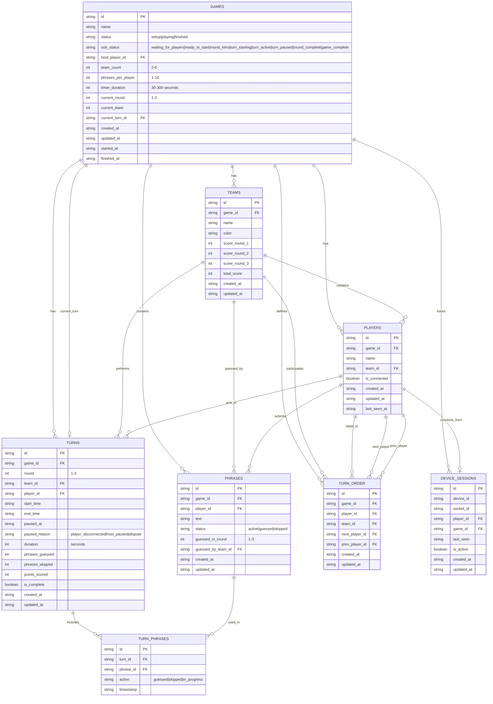

# Fishbowl Database Schema

This document describes the complete database schema for the Fishbowl game application, including all tables, relationships, and constraints.

## Entity Relationship Diagram

## Game Status Flow

The game uses a two-level status system for precise state management:

### Main Status (`status`)
- **setup** - Initial game configuration and setup phase
- **playing** - Active gameplay in progress
- **finished** - Game completed

### Sub-Status (`sub_status`)
Provides granular control within each main status:

#### Setup Phase
- **waiting_for_players** - Players joining, getting assigned to teams, submitting phrases
- **ready_to_start** - All players joined, all phrases submitted, host can start

#### Playing Phase
- **round_intro** - Showing round rules before starting
- **turn_starting** - Brief moment between turns (showing whose turn)
- **turn_active** - Active turn with timer running
- **turn_paused** - Turn paused (disconnection, dispute, etc.)
- **round_complete** - Round finished, showing scores before next round

#### Finished Phase
- **game_complete** - Final scores, game over

## Table Definitions

### Games Table
Manages game configuration and state.

| Column | Type | Constraints | Description |
|--------|------|-------------|-------------|
| id | TEXT | PRIMARY KEY | Unique game identifier |
| name | TEXT | NOT NULL | Display name for the game |
| status | TEXT | NOT NULL, CHECK | Main game status (setup/playing/finished) |
| sub_status | TEXT | NOT NULL, CHECK | Detailed game sub-status |
| host_player_id | TEXT | NOT NULL | Player who created/hosts the game |
| team_count | INTEGER | NOT NULL, DEFAULT 2, CHECK 2-6 | Number of teams in the game |
| phrases_per_player | INTEGER | NOT NULL, DEFAULT 5, CHECK 1-10 | Required phrases per player |
| timer_duration | INTEGER | NOT NULL, DEFAULT 60, CHECK 30-300 | Turn timer in seconds |
| current_round | INTEGER | NOT NULL, DEFAULT 1, CHECK 1-3 | Current round being played |
| current_team | INTEGER | NOT NULL, DEFAULT 1 | Team currently taking their turn |
| current_turn_id | TEXT | FK (optional) | Reference to active turn |
| created_at | TEXT | NOT NULL, DEFAULT CURRENT_TIMESTAMP | Game creation timestamp |
| updated_at | TEXT | NOT NULL, DEFAULT CURRENT_TIMESTAMP | Last update timestamp |
| started_at | TEXT | (optional) | When game started playing |
| finished_at | TEXT | (optional) | When game completed |

### Players Table
Tracks individual players and their connection status.

| Column | Type | Constraints | Description |
|--------|------|-------------|-------------|
| id | TEXT | PRIMARY KEY | Unique player identifier |
| game_id | TEXT | NOT NULL, FK | Game the player belongs to |
| name | TEXT | NOT NULL | Player's display name |
| team_id | TEXT | FK (optional) | Assigned team |
| is_connected | BOOLEAN | NOT NULL, DEFAULT 1 | Current connection status |
| created_at | TEXT | NOT NULL, DEFAULT CURRENT_TIMESTAMP | Player creation timestamp |
| updated_at | TEXT | NOT NULL, DEFAULT CURRENT_TIMESTAMP | Last update timestamp |
| last_seen_at | TEXT | NOT NULL, DEFAULT CURRENT_TIMESTAMP | Last activity timestamp |

**Constraints:**
- UNIQUE(game_id, name) - No duplicate names per game
- ON DELETE CASCADE from games table

### Teams Table
Manages team information and scoring across rounds.

| Column | Type | Constraints | Description |
|--------|------|-------------|-------------|
| id | TEXT | PRIMARY KEY | Unique team identifier |
| game_id | TEXT | NOT NULL, FK | Game the team belongs to |
| name | TEXT | NOT NULL | Team display name |
| color | TEXT | NOT NULL | Team color for UI |
| score_round_1 | INTEGER | NOT NULL, DEFAULT 0 | Points scored in round 1 |
| score_round_2 | INTEGER | NOT NULL, DEFAULT 0 | Points scored in round 2 |
| score_round_3 | INTEGER | NOT NULL, DEFAULT 0 | Points scored in round 3 |
| total_score | INTEGER | NOT NULL, DEFAULT 0 | Sum of all round scores |
| created_at | TEXT | NOT NULL, DEFAULT CURRENT_TIMESTAMP | Team creation timestamp |
| updated_at | TEXT | NOT NULL, DEFAULT CURRENT_TIMESTAMP | Last update timestamp |

**Constraints:**
- UNIQUE(game_id, name) - No duplicate team names per game
- ON DELETE CASCADE from games table

### Phrases Table
Stores all phrases submitted by players and their status.

| Column | Type | Constraints | Description |
|--------|------|-------------|-------------|
| id | TEXT | PRIMARY KEY | Unique phrase identifier |
| game_id | TEXT | NOT NULL, FK | Game the phrase belongs to |
| player_id | TEXT | NOT NULL, FK | Player who submitted the phrase |
| text | TEXT | NOT NULL | The actual phrase text |
| status | TEXT | NOT NULL, DEFAULT 'active', CHECK | Current phrase status |
| guessed_in_round | INTEGER | CHECK 1-3 (optional) | Round when phrase was guessed |
| guessed_by_team_id | TEXT | FK (optional) | Team that guessed the phrase |
| created_at | TEXT | NOT NULL, DEFAULT CURRENT_TIMESTAMP | Phrase creation timestamp |
| updated_at | TEXT | NOT NULL, DEFAULT CURRENT_TIMESTAMP | Last update timestamp |

**Status Values:**
- **active** - Available to be drawn from the bowl
- **guessed** - Successfully guessed by a team
- **skipped** - Skipped during a turn (returns to active)

**Constraints:**
- ON DELETE CASCADE from games and players tables

### Turns Table
Tracks individual player turns during gameplay.

| Column | Type | Constraints | Description |
|--------|------|-------------|-------------|
| id | TEXT | PRIMARY KEY | Unique turn identifier |
| game_id | TEXT | NOT NULL, FK | Game the turn belongs to |
| round | INTEGER | NOT NULL, CHECK 1-3 | Round number for this turn |
| team_id | TEXT | NOT NULL, FK | Team taking the turn |
| player_id | TEXT | NOT NULL, FK | Player acting during the turn |
| start_time | TEXT | (optional) | When turn started |
| end_time | TEXT | (optional) | When turn ended |
| paused_at | TEXT | (optional) | When turn was paused |
| paused_reason | TEXT | CHECK (optional) | Reason for pause (NULL allowed) |
| duration | INTEGER | NOT NULL, DEFAULT 0 | Turn duration in seconds |
| phrases_guessed | INTEGER | NOT NULL, DEFAULT 0 | Number of phrases guessed |
| phrases_skipped | INTEGER | NOT NULL, DEFAULT 0 | Number of phrases skipped |
| points_scored | INTEGER | NOT NULL, DEFAULT 0 | Points earned this turn |
| is_complete | BOOLEAN | NOT NULL, DEFAULT 0 | Whether turn is finished |
| created_at | TEXT | NOT NULL, DEFAULT CURRENT_TIMESTAMP | Turn creation timestamp |
| updated_at | TEXT | NOT NULL, DEFAULT CURRENT_TIMESTAMP | Last update timestamp |

**Pause Reasons:**
- **player_disconnected** - Acting player lost connection
- **host_paused** - Game host manually paused
- **dispute** - Dispute needs resolution

**Constraints:**
- ON DELETE CASCADE from games, teams, and players tables

### Turn Phrases Table
Junction table tracking phrase actions during turns.

| Column | Type | Constraints | Description |
|--------|------|-------------|-------------|
| id | TEXT | PRIMARY KEY | Unique record identifier |
| turn_id | TEXT | NOT NULL, FK | Turn this action occurred in |
| phrase_id | TEXT | NOT NULL, FK | Phrase that was acted upon |
| action | TEXT | NOT NULL, CHECK | Action taken on the phrase |
| timestamp | TEXT | NOT NULL, DEFAULT CURRENT_TIMESTAMP | When action occurred |

**Actions:**
- **guessed** - Phrase was successfully guessed
- **skipped** - Phrase was skipped
- **in_progress** - Phrase is currently being acted out

**Constraints:**
- UNIQUE(turn_id, phrase_id) - One action per phrase per turn
- ON DELETE CASCADE from turns and phrases tables

### Turn Order Table
Implements circular linked list for turn progression.

| Column | Type | Constraints | Description |
|--------|------|-------------|-------------|
| id | TEXT | PRIMARY KEY | Unique record identifier |
| game_id | TEXT | NOT NULL, FK | Game this order belongs to |
| player_id | TEXT | NOT NULL, FK | Player in the turn order |
| team_id | TEXT | NOT NULL, FK | Player's team |
| next_player_id | TEXT | NOT NULL, FK | Next player in sequence |
| prev_player_id | TEXT | NOT NULL, FK | Previous player in sequence |
| created_at | TEXT | NOT NULL, DEFAULT CURRENT_TIMESTAMP | Record creation timestamp |
| updated_at | TEXT | NOT NULL, DEFAULT CURRENT_TIMESTAMP | Last update timestamp |

**Constraints:**
- UNIQUE(game_id, player_id) - One entry per player per game
- ON DELETE CASCADE from games, players, and teams tables

### Device Sessions Table
Tracks device connections and session management.

| Column | Type | Constraints | Description |
|--------|------|-------------|-------------|
| id | TEXT | PRIMARY KEY | Unique session identifier |
| device_id | TEXT | NOT NULL | Unique device identifier |
| socket_id | TEXT | (optional) | WebSocket connection ID |
| player_id | TEXT | FK (optional) | Associated player |
| game_id | TEXT | FK (optional) | Associated game |
| last_seen | TEXT | NOT NULL, DEFAULT CURRENT_TIMESTAMP | Last activity timestamp |
| is_active | BOOLEAN | NOT NULL, DEFAULT 1 | Session active status |
| created_at | TEXT | NOT NULL, DEFAULT CURRENT_TIMESTAMP | Session creation timestamp |
| updated_at | TEXT | NOT NULL, DEFAULT CURRENT_TIMESTAMP | Last update timestamp |

**Constraints:**
- UNIQUE(device_id, game_id) - One session per device per game
- ON DELETE SET NULL for player_id and game_id references

## Database Features

### Automatic Timestamps
All tables include automatic timestamp management:
- `created_at` - Set on record creation
- `updated_at` - Updated automatically on any record change via triggers

### Cascading Deletes
Proper foreign key relationships ensure data integrity:
- Deleting a game removes all associated players, teams, phrases, turns, turn_phrases, turn_order, and device_sessions
- Deleting a player removes their phrases and turn records
- Device sessions are preserved but unlinked (SET NULL) when players/games are deleted

### Indexes
Comprehensive indexing for optimal query performance:
- Primary keys and foreign keys
- Composite indexes for common query patterns (e.g., game_id + status for phrases)
- Status and connection state indexes
- Game and player lookup optimization
- Turn order navigation indexes (next_player_id, prev_player_id)
- Device session lookup by device_id, socket_id, and composite device_id + game_id

### Data Validation
Extensive CHECK constraints ensure data integrity:
- Status enums are strictly enforced
- Numeric ranges are validated (team counts 2-6, rounds 1-3, etc.)
- Timer durations must be between 30-300 seconds
- Phrases per player must be between 1-10
- Pause reasons are restricted to specific values or NULL

## Schema Version
Current schema version: **1**

The database includes migration support for future schema updates while maintaining backward compatibility.