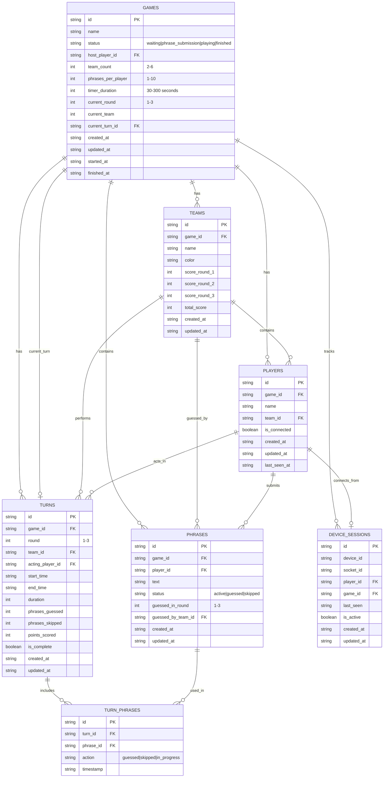

# Fishbowl Database Schema

## Entity Relationship Diagram

```mermaid
erDiagram
    GAMES {
        string id PK
        string name
        string status "waiting|phrase_submission|playing|finished"
        string host_player_id FK
        int team_count "2-6"
        int phrases_per_player "1-10"
        int timer_duration "30-300 seconds"
        int current_round "1-3"
        int current_team
        string current_turn_id FK
        string created_at
        string updated_at
        string started_at
        string finished_at
    }

    PLAYERS {
        string id PK
        string game_id FK
        string name
        string team_id FK
        boolean is_connected
        string created_at
        string updated_at
        string last_seen_at
    }

    TEAMS {
        string id PK
        string game_id FK
        string name
        string color
        int score_round_1
        int score_round_2
        int score_round_3
        int total_score
        string created_at
        string updated_at
    }

    PHRASES {
        string id PK
        string game_id FK
        string player_id FK
        string text
        string status "active|guessed|skipped"
        int guessed_in_round "1-3"
        string guessed_by_team_id FK
        string created_at
        string updated_at
    }

    TURNS {
        string id PK
        string game_id FK
        int round "1-3"
        string team_id FK
        string acting_player_id FK
        string start_time
        string end_time
        int duration
        int phrases_guessed
        int phrases_skipped
        int points_scored
        boolean is_complete
        string created_at
        string updated_at
    }

    TURN_PHRASES {
        string id PK
        string turn_id FK
        string phrase_id FK
        string action "guessed|skipped|in_progress"
        string timestamp
    }

    DEVICE_SESSIONS {
        string id PK
        string device_id
        string socket_id
        string player_id FK
        string game_id FK
        string last_seen
        boolean is_active
        string created_at
        string updated_at
    }

    GAMES ||--o{ PLAYERS : "has"
    GAMES ||--o{ TEAMS : "has"
    GAMES ||--o{ PHRASES : "contains"
    GAMES ||--o{ TURNS : "has"
    GAMES ||--o| TURNS : "current_turn"
    GAMES ||--o{ DEVICE_SESSIONS : "tracks"
    
    TEAMS ||--o{ PLAYERS : "contains"
    TEAMS ||--o{ PHRASES : "guessed_by"
    TEAMS ||--o{ TURNS : "performs"
    
    PLAYERS ||--o{ PHRASES : "submits"
    PLAYERS ||--o{ TURNS : "acts_in"
    PLAYERS ||--o| DEVICE_SESSIONS : "connects_from"
    
    TURNS ||--o{ TURN_PHRASES : "includes"
    
    PHRASES ||--o{ TURN_PHRASES : "used_in"
```